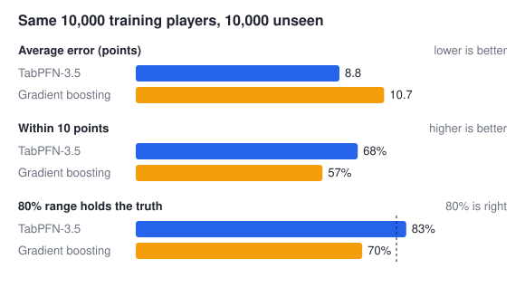
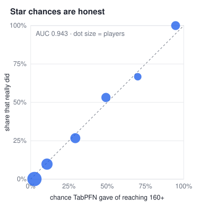
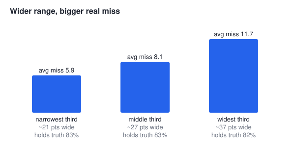
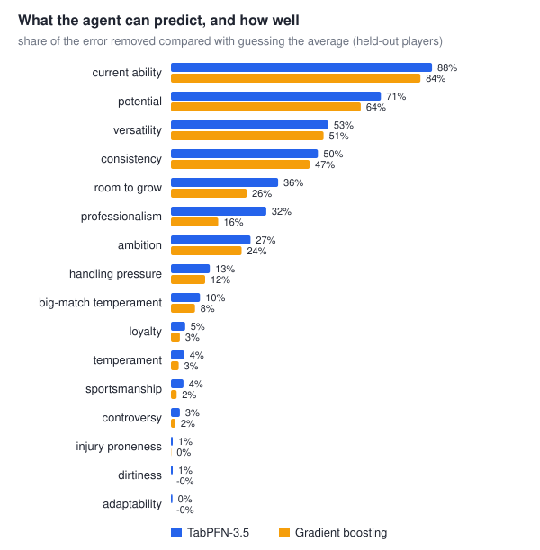

# FM26 Scout: a TabPFN-3.5 scouting agent for Football Manager 26

Every player in Football Manager has a hidden **potential ability** (PA, 1-200): how good they can
ever become. The game never shows it. Players spend hours scouting to guess it.

This project turns a Football Manager 26 save file into a table of 50,000 players and lets
**TabPFN-3.5** learn hidden potential from what you can see: 48 attributes, age, position, club,
contract, traits. An LLM agent turns plain questions into searches, and TabPFN scores **every**
matching player. You don't just get a number. For each pick you get:

- **an estimate**, the median of TabPFN's predictive distribution
- **a likely range**, the 10th to 90th percentile, which really holds the truth 82% of the time
- **a star chance**, the probability of reaching 160+ PA, read off the same distribution. On
  unseen players it matches what really happens (chart below).

A **second TabPFN model** fills in the market value for the half of all players whose save stores
none, so budget searches stay meaningful. TabPFN runs **on your own computer** (GPU or Apple
silicon) or at Prior Labs; both are the same TabPFN-3.5.

```text
What are you looking for? five wonderkid central midfielders under 21, max €20M
  Searching your save...
  Estimating potential for 3,939 players...
  Taking a closer look at the best candidates...

1. Vasco W. Keller · 19 · Brighton & Hove Albion · €18.7M
   Potential ≈ 177 (likely 160–182) · 90% chance of reaching 160+
   A 19-year-old left-footed midfielder who already looks ready to contribute, with outstanding
   vision and technique plus strong teamwork and stamina.
...
5. Omar N. Correia · 15 · Real Murcia C.F. · €13.9M
   Potential ≈ 163 (likely 140–181) · 56% chance of reaching 160+
   This season: 4 games · 0 goals · 0 assists · avg rating 6.40
```

**Upside or safety.** Ask for the most upside and it ranks by the top of each range instead
("boom or bust"). The uncertain 15-year-old above jumps from fifth to second. Ask for safe picks
and it ranks by the bottom. The same scores are used, with no new model call:

```text
What are you looking for? central midfielders under 21 up to €20M: the three with the biggest upside
1. Vasco W. Keller · 19 · Brighton & Hove Albion · €18.7M   Potential ≈ 177 (likely 160–182)
2. Omar N. Correia · 15 · Real Murcia C.F. · €13.9M         Potential ≈ 163 (likely 140–181)
3. Enzo I. Xuereb · 15 · Red Star FC · €17.4M               Potential ≈ 173 (likely 155–180)
Ranked by best case: the top of each player's range.
```

**Players like someone.** It compares visible attribute profiles, keeps the 100 closest at his
positions, and lets TabPFN pick those with the most potential. "A cheaper version of X" just adds
a budget:

```text
What are you looking for? find me three cheaper versions of Pedro G. Ferreira, max 10M
1. Gabriel M. Novak · 32 · Genoa C.F.C. · €5.7M · 83% profile match
   Potential ≈ 154 (likely 142–163) · 23% chance of reaching 160+
```

**Predictions the agent builds itself.** Potential is only one hidden number. The save also
knows current ability, consistency, professionalism, injury proneness and more, none of which a
scout can see. For "a striker in his prime", the agent picks `current_ability` from a glossary of
16 hidden targets. TabPFN learns it on the spot from the 10,000 reference players, checks itself on
2,000 players it never saw, and ranks the search by it. The agent sees only the glossary and that
quality report, never training data:

```text
$ fm26-agent find --demo --position STC --age-min 24 --age-max 29 --max-value 10M --predict current_ability
  Teaching TabPFN to predict current ability and checking it on players it hasn't seen...
  Estimating current ability for 3,263 players...

1. Xavi N. Torres · 27 · LA Galaxy · €5.5M
   Current ability ≈ 152 (likely 135–167)
...
Current ability is hidden in the game (scale 1-200); TabPFN learned it for this question from
10,000 players. On 2,000 players it hadn't seen it was off by 3.2 on average (guessing the average
would be off by 26.49), and the range held the real value 84% of the time.
```

When the visible data can't support a target, the report says so, and the agent tells the user
the order is only a rough guide ([results for all 16](#what-the-agent-can-predict)).

## Try it in five minutes (no Football Manager, no keys)

The repository includes `sample/players.csv.gz`, all 50,202 players of a real FM26 save with
made-up names, plus their real potential as the training target.

```sh
conda env create -f environment.yml && conda activate fm26-agent    # includes local TabPFN
# or: python3.12 -m venv .venv && source .venv/bin/activate && pip install -e ".[local,dev]"

fm26-agent find --demo --position MC --age-max 20 --max-value 10M
fm26-agent find --demo --position STC --age-max 21 --rank ceiling --count 3
fm26-agent find --demo --like "Pedro G. Ferreira" --max-value 10M   # a cheaper lookalike
fm26-agent find --demo --position DC --age-max 23 --predict consistency --threshold 15 --rank chance
```

On a Mac with Apple silicon or a PC with an NVIDIA GPU, TabPFN runs locally. That needs **no key
and no account**: the TabPFN-3.5 weights (about 1 GB) download once into `data/tabpfn-weights`.
After the one-time weights download, the first run sets up the demo (both models fitted locally)
in about 2.5 minutes on an M-series Mac. After that each search takes seconds.

`find` runs the same tools and answer checks as the agent; code writes a short line on each
player's best attributes instead of an LLM. For the chat in plain words, add a DeepSeek key:

```sh
fm26-agent --demo        # asks for a DeepSeek key once (platform.deepseek.com/api_keys)
```

> "best left-footed wingers under 21" · "goalkeepers at Real Madrid or Barcelona" ·
> "a striker on an expiring contract who could become world class" · "three safe centre-backs under 23"

**Without a GPU,** TabPFN runs at Prior Labs instead. The tool asks for a free TabPFN key
([platform.priorlabs.ai](https://platform.priorlabs.ai/account/api-keys)). You can choose
explicitly with `FM26_TABPFN_BACKEND=local` or `hosted`, or with `[tabpfn] backend = "..."` in
`config.toml`.

**With your own game,** put an FM26 save (`.fm`, build `26.3.2+2329565`) in this folder and run
`fm26-agent`. It finds the save, reads it with [fmsave](https://pypi.org/project/fmsave/) and sets
it up.

To reproduce the numbers and charts below, run `python scripts/evaluate_model.py --demo` and
`python scripts/evaluate_targets.py --demo`.

## How TabPFN-3.5 is used

| Step | What TabPFN does | Why it matters here |
|---|---|---|
| **Potential model** (setup, once) | `TabPFNRegressor` v3.5 is fitted on 10,000 representative players with `fit_with_cache` and saved | A foundation model needs no training loop or tuning. The raw table goes in as it is: 53 numbers, 5 categories (club, nation, foot, positions) and a free-text trait list. Missing values are left missing. |
| **Every question** | `predict(output_type="quantiles")` returns 19 percentiles for every matching player, often 4,000+ at once | The estimate, 80% range and star chance all come from this one distribution. Results are cached per player, so re-ranking and follow-ups are instant. |
| **Market-value model** (setup, once) | A second regressor learns log(value) from 10,000 players who have one, then estimates the 23,931 who don't, with a range | Budget filters use the estimate instead of letting unpriced players through blindly. The same request also scores 2,000 players with a known value, so every setup grades its own estimates. |
| **Agent tools** | The LLM calls `predict_player_potential` with a `search_id` and a ranking mode (`expected`, `ceiling`, `safe`, `chance`) | Uncertainty isn't just shown, it changes the ranking. "Upside" and "safe bet" are real scouting styles. |
| **Agent-built tasks** (on demand) | `build_prediction_task` fits a new regressor on any of 16 hidden targets, self-checks on 2,000 held-out players against guessing the average, and `predict_with_task` scores the whole search | A new model mid-conversation is only practical because TabPFN needs no training loop or tuning. Fits are saved, so a target costs one fit per save. |

The 10,000 training players are chosen to mirror the whole save: the same share of wonderkids
(PA 160+), and the same mix of every input (age, positions, value, club, attributes). Real
potential is **only the training target**, never an input. Current ability, hidden attributes
and personality are stored privately and used only as targets of agent-built tasks. Every one of
them is a forbidden feature, so no model ever sees them as inputs.

**Local or hosted.** `tabpfn_backend.py` hides the difference: the local `tabpfn` package on
CUDA or Apple MPS (predictions in memory-safe chunks, fitted state saved beside `model.json`), or
`tabpfn-client` at Prior Labs (one request per search, since a request costs the same whatever its
size). On the demo, local scored 10,000 unseen players in 27 seconds on an M-series MacBook.

## How good is it?

These are players the model never saw: 10,000 held out from the demo save, local TabPFN-3.5.
For comparison, scikit-learn gradient boosting was fitted on the **same** 10,000 training players,
with its own quantile models for 80% ranges.



| | TabPFN-3.5 | Gradient boosting |
|---|---|---|
| Average error | **8.58** points | 10.67 |
| Within 10 points | **69%** | 57% |
| R² | **0.878** | 0.836 |
| 80% range really holds the truth | **82%** | 70% |
| Tuning, feature engineering | none | frequency-encoded categories, hand-set trees |

Guessing the average potential for everyone would be off by 28.9 points. The hosted TabPFN-3.5
gives the same picture (8.75 average error, 83% range coverage).

**The star chances are honest.** Players TabPFN gave a 5–20% chance reached 160+ 10% of the time,
and those given 20–40% did so 27% of the time. Every one of the 37 players given 80–100%
really did. AUC is 0.943, and the Brier score is half that of always quoting the base rate.



**Wider ranges mean real risk.** The model knows which players it is unsure about:



**Market values** (the second model, checked on 2,000 players whose real value it never saw):
- The typical estimate is 38% off, and R² on log value is 0.90.
- The 80% range holds the real value 83% of the time. It is honest, but wide, because a player's
  value depends a lot on things a profile doesn't show.
- That's why the tool labels these values "est." and shows the range, for example
  `est. €2.1M–9.4M`, and uses them only for players the save gives no value.

More results from the same run:
- **Top picks:** the 25 players it rates highest (all ages) all really have 160+ potential,
  averaging 178.2 (the best possible 25 average 183.4). For under-22s, 7 of its top 10 are real
  wonderkids.
- **By age:** the average error is 8.0–8.9 in every age band.
- **Players with no stored market value:** the error for them is 9.5, against 7.7 for players
  with one.
- **Full numbers:** [docs/results.json](docs/results.json).

### What the agent can predict

Every target in the glossary, on the demo, local TabPFN-3.5: fitted on the same 10,000 players,
checked on 2,000 it never saw, against gradient boosting on the same data.



| Target | TabPFN avg error | Gradient boosting | Error removed vs guessing | Verdict |
|---|---|---|---|---|
| Current ability (1-200) | **3.20** | 4.24 | 88% | useful |
| Potential (1-200) | **8.49** | 10.44 | 71% | useful |
| Versatility | **1.46** | 1.52 | 53% | useful |
| Consistency | **1.73** | 1.82 | 50% | useful |
| Room to grow (PA − CA) | **8.51** | 9.91 | 36% | useful |
| Professionalism | **1.38** | 1.71 | 32% | useful |
| Ambition | **2.83** | 2.94 | 27% | useful |
| Handling pressure | **2.59** | 2.64 | 13% | weak |
| Big-match temperament | **2.46** | 2.51 | 10% | weak |
| Loyalty, temperament, sportsmanship, controversy, injury proneness, dirtiness, adaptability | 2.5–3.0 | slightly worse | 0–5% | not predictable |

Hidden attributes and personality are on a 1-20 scale. TabPFN beats boosting on all 16. Just as
important, it tells which targets it can't learn: for the last group the save's visible data
barely beats guessing, and every answer ranked by one of them says so. Full numbers:
[docs/targets.json](docs/targets.json).

What didn't help: fitting a separate TabPFN per query on only the matching slice was worse (for
example 10.4 vs 8.9 average error for midfielders under 21), because fewer rows hurt more than
relevance helps. Averaging five fits on different 10,000-player contexts gave 9.01 vs 9.09. One
fitted model is the right trade.

## How the agent stays honest

The LLM (DeepSeek, OpenAI-compatible) plans; code checks every answer before you see it:

1. It turns the question into filters: age, value, position, club (one or several), stronger foot,
   contract expiry and "players like X". Anything it can't filter (nationality, league, wage) it
   says so instead of guessing.
2. `search_players` returns a handle for the **complete** matching pool.
   `predict_player_potential` scores all of it, not just the first page.
3. The final answer must be JSON matching a schema. Code then checks that the constraints match
   the search, every pick is eligible, the whole pool was scored, and the order matches the chosen
   ranking mode. A wrong answer is sent back to the agent with the reason, and never silently
   repaired.
4. Names, clubs, prices, estimates, ranges, profile matches and this season's stats (games, goals,
   assists, rating) are printed by code, not by the LLM, so the numbers can't be made up.

```text
save.fm ──fmsave──▶ 50k players ─┬─▶ players.sqlite3 (what you can see, season stats)
                                 └─▶ labels.sqlite3  (real potential + hidden targets, training only)
                                          │
        10k sample ──▶ TabPFN-3.5 potential model (once) ──▶ model.json
        10k priced ──▶ TabPFN-3.5 value model (once) ──▶ estimates for unpriced players
                                                                     │
question ─▶ DeepSeek agent (or `find`) ─▶ search_players ─▶ predict_player_potential ─▶ checked shortlist
                                            (all matches)    (median, range, star chance)
```

## Good to know

- **Prices:** the save stores values in its own units. Match them to your game with
  `fm26-agent calibrate 'Name=4.5M' 'Other Name=12M' --apply` (`fm26-agent spotcheck` suggests who
  to look up). Nothing has to be refitted.
- **Supported saves:** only FM26 build `26.3.2+2329565`, the final update. The tool checks this and
  explains if a save can't be read. A save from an older FM26 update can be loaded and saved again
  in the latest game.
- **Prospect questions:** potential only matters for players who are still developing, so
  "prospect" or "wonderkid" without an age means under 22.
- **Privacy:** with local TabPFN, your save and the models never leave your computer. Only your
  questions and the players discussed go to DeepSeek, if you use the chat. With hosted TabPFN, the
  training players also go to Prior Labs.
- **Cost:** local TabPFN is free. Hosted, it is one request per new search; repeats and re-ranked
  searches come from the local cache.

## For developers

```sh
pytest -m "not hosted and not integration"      # offline tests, all services mocked
python scripts/evaluate_model.py --demo         # accuracy report + charts
python scripts/evaluate_model.py --redraw       # redraw the charts from docs/results.json
python scripts/evaluate_targets.py --demo       # every agent-buildable target vs boosting
python scripts/export_sample.py                 # rebuild sample/ from a prepared save
FM26_RUN_HOSTED_TESTS=1 FM26_RUN_AGENT_SMOKE=1 pytest -m hosted    # live services, needs both keys
FM26_TEST_SAVE=<save>.fm pytest -m integration                      # reads a real save, read-only
```

| File | Role |
|---|---|
| `extract.py` | Reads the save with fmsave. Checks the game build and that potential is plausible (never below current ability). Hidden values go to the private store only. |
| `sampling.py`, `prepare.py` | Picks the 10,000 training players and fits the models once. |
| `features.py`, `prediction.py` | The raw feature table. One quantile prediction gives the estimate, range and star chance. |
| `tabpfn_backend.py` | Local (`tabpfn`, CUDA or MPS) or hosted (`tabpfn-client`) TabPFN-3.5. |
| `value_model.py` | The market-value model and its self-check. |
| `targets.py`, `custom_tasks.py` | The glossary of hidden targets and the agent-built TabPFN tasks: fit, self-check, cache, predict. |
| `tools.py`, `agent.py`, `finder.py` | The agent's tools, ranking modes, lookalike search, answer checks, and the LLM-free `find`. |
| `app.py`, `cli.py` | The guided command-line experience. `runtime.py` is what a web front end would call. |
| `sample.py` | The portable demo dataset. |

Everything the tool writes stays inside this folder, including the local TabPFN weights. `--demo`
keeps its data in `data/demo`, so it never replaces your own setup.

## Licence

Apache License 2.0, see [LICENSE](LICENSE). Football Manager is a trademark of Sports Interactive
and SEGA; this project is not affiliated with them.
